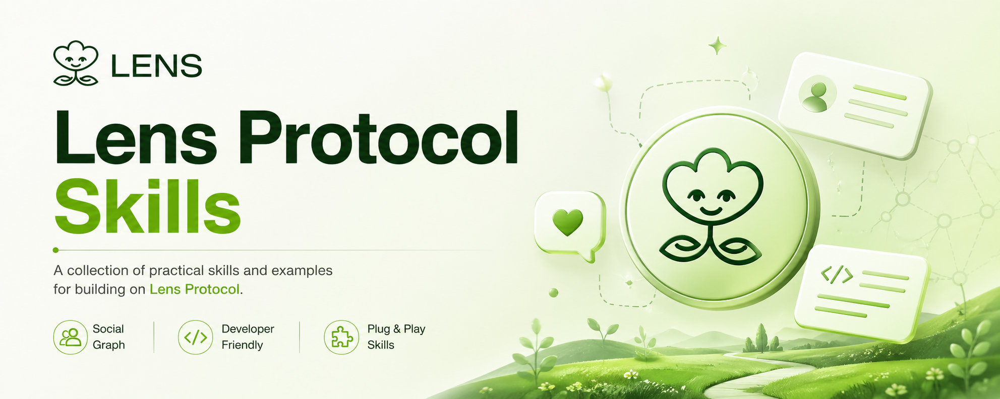

# Lens Protocol Skills



A structured knowledge base and code skill pack designed for AI agents (Cursor, opencode, Claude, etc.) to rapidly build social applications on the [Lens Protocol](https://www.lens.xyz/) ecosystem.

> [中文版](./README.zh.md)

## What Can You Build?

With Lens Protocol as the decentralized backbone, you can build **any kind of social application**:

- **Personal blogs & newsletters** — decentralized publishing, user-owned content
- **Microblogging platforms** — similar to X/Twitter, fully decentralized
- **Community forums** — niche communities with custom governance
- **Social feeds & content platforms** — curated feeds with custom algorithms
- **Group-based social networks** — private or public communities
- **Anything else** — Lens's composable architecture supports virtually any social product

## Why Lens Protocol?

- **Decentralized** — users own their identity, content, and social graph. No platform lock-in.
- **Free to use** — Lens API covers everything: gas fees, image uploads, video hosting. Posting, storing, sharing — zero cost for users.
- **Secure** — built on Lens Chain (ZKsync L2), inheriting Ethereum-grade security.
- **Composable** — mix and match accounts, feeds, graphs, groups, and rules like building blocks.

## Project Structure

```
├── skills/
│   ├── SKILL.md                 # Main skill definition & design guidelines
│   ├── examples/
│   │   ├── client-setup.ts      # SDK initialization & fragment definition
│   │   ├── auth.ts              # Authentication flows (4 login modes)
│   │   ├── account.ts           # Account CRUD, managers, block/mute
│   │   ├── post.ts              # Post, comment, quote, repost, reactions
│   │   ├── content-read.ts      # Feed reading, pagination, view models
│   │   ├── social.ts            # Follow, groups, notifications, recommendations
│   │   └── storage.ts           # Grove decentralized storage operations
│   └── ref/
│       ├── actions.md           # SDK action function reference
│       ├── graphql.md           # GraphQL query/mutation patterns
│       ├── graphql-schema.graphql # Schema snapshot for quick lookup
│       └── metadata.md          # Metadata builder & schema selection
├── README.zh.md                 # Chinese version
├── llms.txt                     # Packed codebase for LLM consumption
└── package.json
```

## Core Modules

| Module | Description |
|--------|-------------|
| **Account** | On-chain identity with metadata (name, bio, avatar), account managers, block/mute |
| **Feed** | Content publishing & distribution: text, image, article, video post types |
| **Graph** | Social graph: follow/unfollow, followers, following, mutuals |
| **Group** | On-chain groups with membership management, approval workflows, bans |
| **Username** | Human-readable identifiers (`namespace/localName`) |
| **App** | Application configuration: default feed, graph, namespace, sponsorship |
| **Rules** | Pluggable modules constraining feeds, graphs, groups, posts, follows |
| **Actions** | Extensible on-chain actions: collect, tip, and more |
| **Sponsorship** | Gas fee sponsorship for gasless user experiences |
| **Grove** | Decentralized storage layer for metadata, images, videos |

## Quick Start

Tell your AI agent (Cursor, opencode, Claude, etc.):

> Install Lens Protocol Skills from: <https://github.com/xiaok/lens-protocol-skills>

The agent will load everything in `skills/` and start generating Lens social app code.

### Try These Prompts

| Prompt | What it does |
|--------|-------------|
| `Write a post and publish it on Lens` | Generates the full post flow |
| `Upload an image and give me the link` | Generates Grove upload code |
| `Build me a personal blog` | Generates a complete personal blog app |
| `Build me a gaming forum with Privy login, full UI, post list / posting / replies / tag-based groups, UI themed after Slay the Spire to attract gamers` | Generates a complete gaming community app |

## Environments

| Environment | Chain ID | Gas Token | SDK Env |
|-------------|----------|-----------|---------|
| Mainnet | 232 | GHO | `mainnet` |
| Testnet | 37111 | GRASS | `testnet` |

## License

MIT
